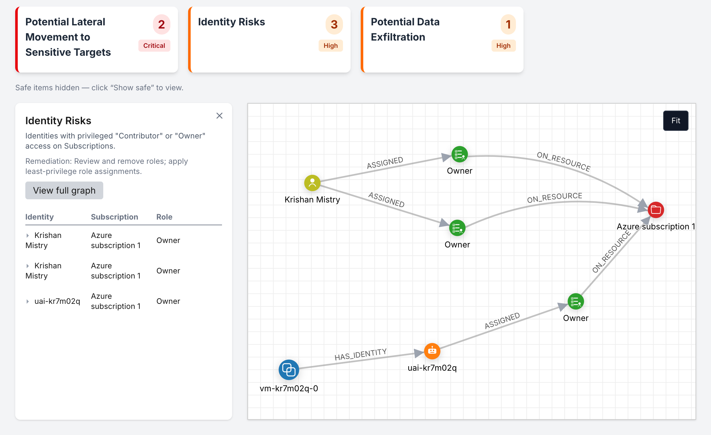

# cloudexplorer

A visualisation of resources and IAM resources in the Public Cloud. Inspired by the Wiz security graph.

Currently only supports Azure, but designed with the other public clouds in mind (custom adapters would be required).



## Technology used


### D3.js

Main rendering engine for the graph visualisations. _Why not?_

### Choosing a database

The initial version of cloudexplorer used Neo4j, a fairly well known graph database - this worked well in representing the structure of resources within the cloud.

The current architecture of cloudexplorer leverages an embedded database that runs entirely in the browser, meaining all data lives client-side. To achieve this in the browser, databases typically utilise WebAssembly (WASM).

There's a much smaller selection of this category of databases in existence, here's three which I trialled:

1. **DuckDB WASM**: traditional relational database, queried with SQL, actively maintained
2. **Kuzu**: property graph database, queried using Cypher (similar to Neo4j), no longer maintained.
3. **Ladybug**: an open-source fork of Kuzu continued from the last commit

I settled for DuckDB.

## Configuring sign in

### Azure

To sign in to Azure, you need to create and configure an App Registration as per [these docs](https://github.com/Azure/azure-sdk-for-js/blob/main/sdk/identity/identity/interactive-browser-credential.md#for-browsers).

For successful auth, a `single-page application` redirect URI should be configured to point to:

```
https://cloudexplorer.krishanmistry.com
```

API permissions should be configured as follows:

| API                      | Permissions name     | Type      |
| ------------------------ | -------------------- | --------- |
| Azure Service Management | `user_impersonation` | Delegated |
| Microsoft Graph          | `Directory.ReadAll`  | Delegated |
| Microsoft Graph          | `User.Read`          | Delegated |

In addition, RBAC `Reader` permissions should be given to subscriptions for the app registration
